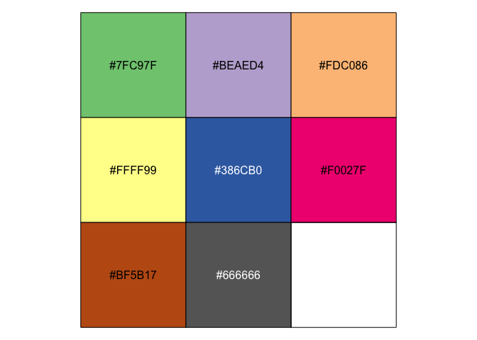
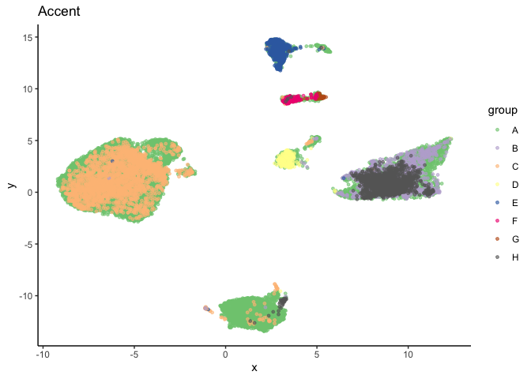
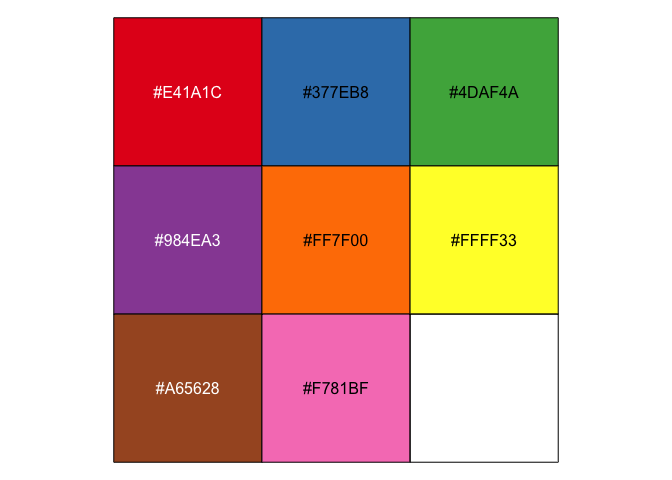
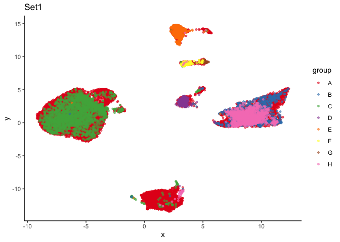
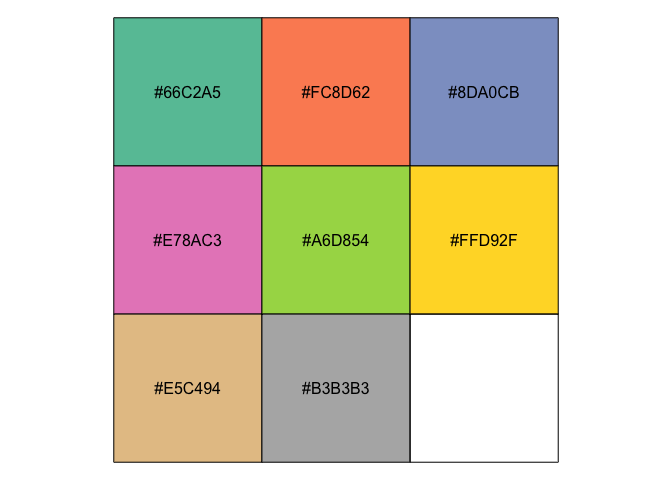
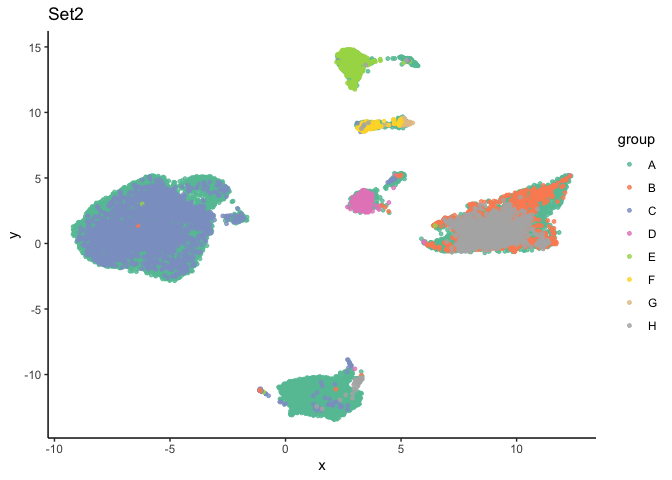
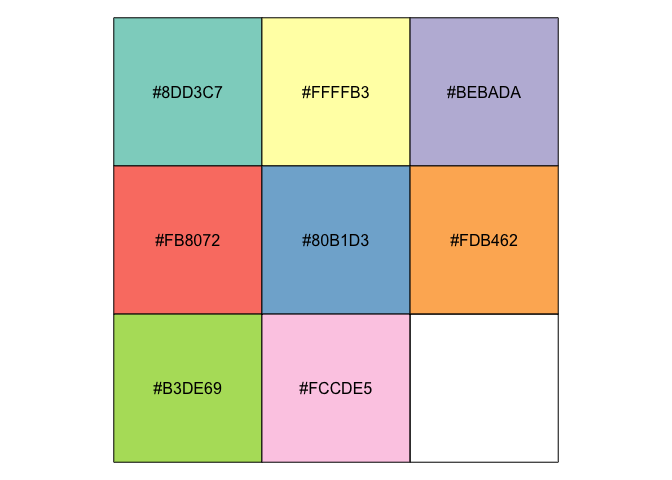
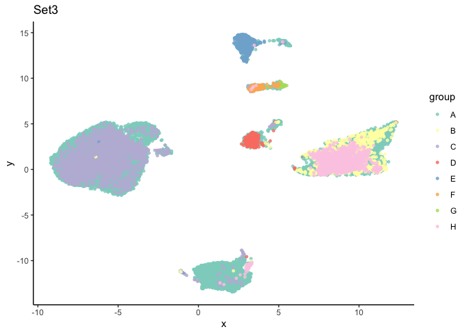
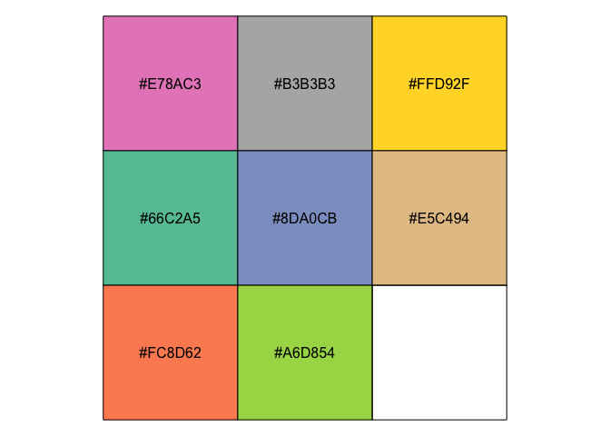
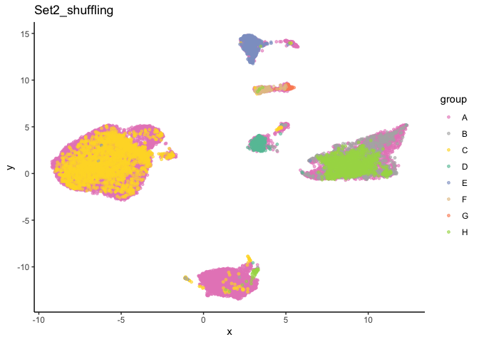

# To study colors

<h3> About "Accent", "Set1", "Set2" and "Set3" of colorRampPalette </h3>

``` r
require(dplyr)
library(tidyr)
library(reshape2)
library(ggplot2)
library(furrr)
library(tibble)
library(purrr)
library(reticulate)
library(viridis)
library(ggrepel)
library(patchwork)
library(ggridges)
library(ggpubr)
library(gtools)
library(RColorBrewer)
library(scales)
setwd("./")
indir = "../data/"
D <- read.table(paste0(indir, "example.txt"), sep = "\t", header = TRUE)
```

``` r
head(D)
```

    ##           x           y group
    ## 1 -4.606929  -2.3237624     A
    ## 2  2.598112 -11.6848116     A
    ## 3 -8.445557   0.2385228     A
    ## 4 -5.737138   3.9355512     A
    ## 5 -6.080631   1.4217436     A
    ## 6  2.860372  14.6534634     A


<br><br><br>
### 1. To use "Accent" color set 
<br>


``` r
getPalette = colorRampPalette(brewer.pal(8, "Accent")) 

group <- factor(D$group, levels=sort(unique(D$group)))
colourSet = setNames(getPalette(length(levels(group))), levels(group))
colourSet
```

    ##         A         B         C         D         E         F         G         H 
    ## "#7FC97F" "#BEAED4" "#FDC086" "#FFFF99" "#386CB0" "#F0027F" "#BF5B17" "#666666"

``` r
show_col(colourSet)
```

<!-- -->

``` r
ggplot(D, aes(x=x, y=y, color=group) ) +
                  scale_color_manual(values=colourSet) +
                  geom_point(size=1, alpha=0.6) +
                  labs(title = "Accent") +        
                  theme_classic()
```

<!-- -->


<br><br><br>
### 2. To use "Set1" color set
<br>


``` r
# "Set1" color set
getPalette = colorRampPalette(brewer.pal(8, "Set1")) 

group <- factor(D$group, levels=sort(unique(D$group)))
colourSet = setNames(getPalette(length(levels(group))), levels(group))
colourSet
```

    ##         A         B         C         D         E         F         G         H 
    ## "#E41A1C" "#377EB8" "#4DAF4A" "#984EA3" "#FF7F00" "#FFFF33" "#A65628" "#F781BF"

``` r
show_col(colourSet)
```

<!-- -->

``` r
ggplot(D, aes(x=x, y=y, color=group) ) +
                  scale_color_manual(values=colourSet) +
                  geom_point(size=1, alpha=0.6) +
                  labs(title = "Set1") +
                  theme_classic() 
```

<!-- -->


<br><br><br>
### 3. To use "Set2" color set 
<br>

``` r
getPalette = colorRampPalette(brewer.pal(8, "Set2")) 

group <- factor(D$group, levels=sort(unique(D$group)))
colourSet = setNames(getPalette(length(levels(group))), levels(group))
colourSet
```

    ##         A         B         C         D         E         F         G         H 
    ## "#66C2A5" "#FC8D62" "#8DA0CB" "#E78AC3" "#A6D854" "#FFD92F" "#E5C494" "#B3B3B3"

``` r
show_col(colourSet)
```

<!-- -->

``` r
p <- ggplot(D, aes(x=x, y=y, color=group) ) +
                  scale_color_manual(values=colourSet) +
                  geom_point(size=1, alpha=0.8) +
                  labs(title = "Set2") +
                  theme_classic()  

print(p)
```

<!-- -->


<br><br><br>
### 4. To use "Set3" color set
<br>

``` r
getPalette = colorRampPalette(brewer.pal(8, "Set3")) 

group <- factor(D$group, levels=sort(unique(D$group)))
colourSet = setNames(getPalette(length(levels(group))), levels(group))
colourSet
```

    ##         A         B         C         D         E         F         G         H 
    ## "#8DD3C7" "#FFFFB3" "#BEBADA" "#FB8072" "#80B1D3" "#FDB462" "#B3DE69" "#FCCDE5"

``` r
show_col(colourSet)
```

<!-- -->

``` r
ggplot(D, aes(x=x, y=y, color=group) ) +
                  scale_color_manual(values=colourSet) +
                  geom_point(size=1, alpha=0.8) +
                  labs(title = "Set3") +
                  theme_classic()  
```

<!-- -->


<br><br><br>
### 5. To use the shuffled "Set2" color set 
<br>

``` r
getPalette = colorRampPalette(brewer.pal(8, "Set2")) 
L <- sort(unique(D$group))
L <- L[sample(1:length(L))]
group <- factor(D$group, levels=sort(unique(D$group)))
colourSet = setNames(getPalette(length(levels(group))), L)
colourSet <- colourSet[sort(unique(D$group))]
colourSet
```

    ##         A         B         C         D         E         F         G         H 
    ## "#E78AC3" "#B3B3B3" "#FFD92F" "#66C2A5" "#8DA0CB" "#E5C494" "#FC8D62" "#A6D854"

``` r
show_col(colourSet)
```

<!-- -->

``` r
ggplot(D, aes(x=x, y=y, color=group) ) +
                  scale_color_manual(values=colourSet) +
                  geom_point(size=1, alpha=0.6) +
                  labs(title = "Set2_shuffling") +
                  theme_classic()  
```

<!-- -->


### Acknowledgements

https://r4ds.had.co.nz/r-markdown.html

https://www.markdownguide.org/basic-syntax/


